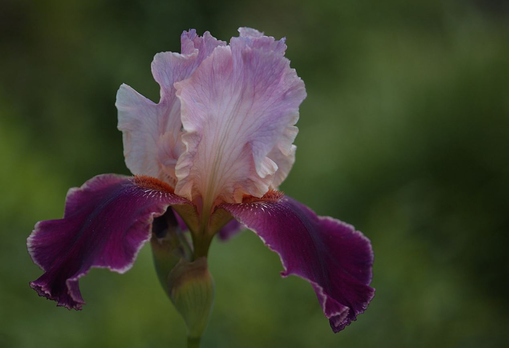

# Introduction {#basic-example}

Here is the standard code chunk that I put at the top of all of my bookdown pages.  This provides the default settings that will be used throughout the remainder of the page.  Note that any of these settings can be overridden for each individual chunk.  

In the chunk header I include the statement `{r, include=TRUE}` which means to include this chunk in the document output.  I normally leave it as FALSE which allows the chunk to run but not to be included in the output. 

```{r, include=TRUE}
### Document settings
knitr::opts_chunk$set(echo = TRUE,
                      results = 'hold',
                      message = FALSE,
                      warning = FALSE,  out.width="100%", fig.align='center' )

### Table formatting
### Table outputs need to be declared when using kableExtra::kable_styling()

    tformat <- "markdown" ## Unless it is latex or html ....
    if (knitr::is_latex_output()) {tformat <- "latex"}
    if (knitr::is_html_output())  {tformat <- "html"}


```

Next I load all the libraries that I will use in this page. 

```{r}
library(tidyverse)
library(knitr)       ## for tables 
library(kableExtra)  ## for table formatting 

```

## Example of a citation

For my MSc I had to take a deeper dive into quantitative ecology than I was expecting.  Numerical Ecology with R by @borcardNumericalEcology2018 was a key resource.  Next, is an typical example with 2 references following a sentence: In my MSc. it is well know that dead wood / also known as coarse woody debris is a very important physical feature for biodiversity [@harmonEcologyCoarseWoody1986a; @stoklandBiodiversityDeadWood2012]. 


## An example using the iris dataset.  

```{r irisphoto, fig.cap="An iris.  "}



```


I chose `iris` as I recently used it to learn how to do some of my MSc analysis.  
The dataset provides physical attributes of three species of iris.  Figure \@ref(fig:irisphoto) provides quite a beautiful image of an iris taken by [Sandy Thompson](https://www.flickr.com/photos/sandythompson/).  ... I don't know what species of iris this is.  Do you? 


Let's do some stats: 

```{r}
dat <- iris
dat <- dat %>% mutate(Species = as.factor(Species))

str(dat)
```


```{r iris-sample}

dat %>% sample_n(10) %>% 
  kable(format = tformat,  ## note tformat declared above
        caption = "A sample of from the iris dataset.")  %>% 
  kableExtra::kable_styling()  ## makes the table pretty ... MANY options

```


```{r irisboxplot, fig.cap="Measurements of physical features of various iris species."}

dat.long <- dat %>% 
  pivot_longer(cols = Sepal.Length:Petal.Width,
               names_to = "trait",
               values_to = "metric")

dat.long %>% ggplot(aes(x = Species, y = metric)) +
  geom_boxplot() + 
  facet_wrap(~ trait,
             nrow = 2)

```

<!-- I really don't like this iris  -->


## Stats

Are the species different based on their physical attributess

- Sepal length
- Sepal width 
- Petal length 
- Petal width 

I'll make a few assumptions that the data meets the assumptions repated to ANOVA.  Here is the base R ANOVA output. Alternately, using the `broom` package the data can be cleaned up and pushed to a table format (\@ref(tab:anova))

```{r}
response <- dat %>% dplyr::select(Sepal.Length, Sepal.Width, Petal.Length, Petal.Width)


dat.lm <- lm(as.matrix(response) ~ Species,
            data = dat)

anova(dat.lm)
```


```{r anova}

anova(dat.lm) %>% broom::tidy() %>% 
  kable(format = tformat,
        caption = "ANOVA output in a table format.")

```


